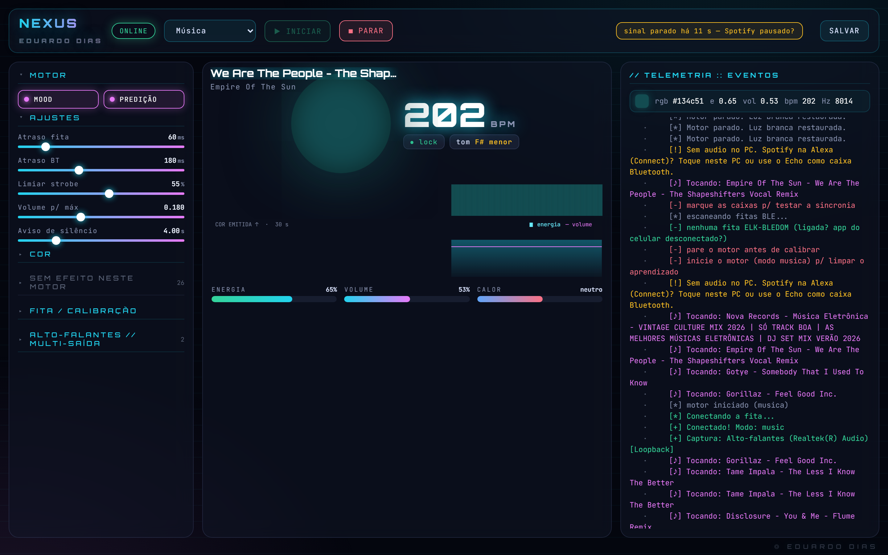
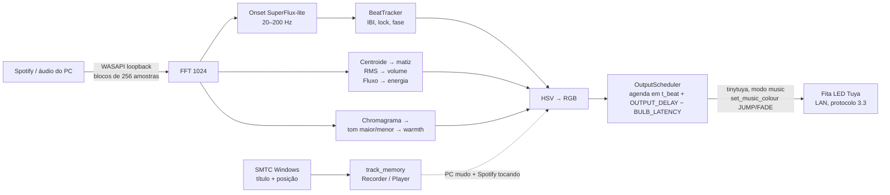
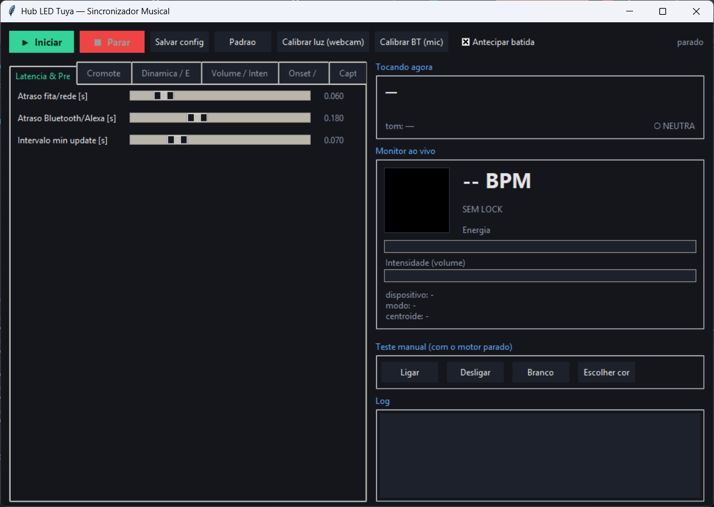

# fita-led-tuya-sync

Sincroniza uma fita LED RGB Tuya (Wi-Fi, protocolo local 3.3) com a música que
está tocando no PC. Sem nuvem Tuya, sem API do Spotify, sem microfone: o motor
ouve o **loopback WASAPI** do Windows, detecta batida e timbre em tempo real e
manda cor pela LAN, adiantando cada comando para compensar a latência da fita.



*Painel web (NEXUS) com o motor rodando: 202 BPM lockado, tom F# menor, faixa de
cor emitida nos últimos 30 s, telemetria a 20 Hz.*

## O que ele faz

- **Batida preditiva.** Onset por SuperFlux-lite na banda 20–200 Hz, rastreador
  de intervalo entre batidas (mediana dos últimos 8 IBIs; lock quando o desvio
  relativo fica abaixo de 12 %). Quando trava
  o BPM, o pulso de luz é agendado *antes* da batida chegar: `OUTPUT_DELAY`
  (180 ms, o atraso do Bluetooth/Alexa) menos `BULB_LATENCY` (60 ms, o atraso da
  fita). A luz e o som chegam juntos no ouvido.
- **Cromoterapia por timbre.** Centroide espectral (150–5000 Hz) vira matiz;
  RMS vira intensidade; fluxo espectral vira "energia". Grave = vermelho/laranja,
  agudo = azul/violeta.
- **Mood pelo tom.** Chromagrama correlacionado com os perfis de
  Krumhansl-Schmuckler dá a tonalidade local (ex.: "F# menor"). Maior e rápido
  puxa a paleta para quente (âncora hue 0,05); menor e lento puxa para frio
  (hue 0,60). `MOOD_INFLUENCE` regula quanto.
- **Volume mestre.** Silêncio apaga a fita; volume alto satura. Ataque 0,5,
  release 0,08, gama 0,7.
- **Memória de faixa.** Na primeira vez que uma música toca pelo PC, o motor grava
  onsets e curvas de cor/energia indexados pela posição da faixa em
  `learned/<artista - título>.json`. Quando a mesma música toca na Alexa via
  Spotify Connect (o PC não ouve nada), ele lê a posição pelo SMTC do Windows e
  **reproduz a timeline aprendida**. Detalhe em [track_memory.py](track_memory.py).
- **Metadata 100% local.** Título, artista e posição vêm do
  `GlobalSystemMediaTransportControls` (winrt). O Spotify fechou o endpoint de
  audio-features em nov/2024 para apps novos, então BPM e modalidade são
  calculados aqui mesmo.
- **Calibração.** Latência da fita medida por webcam (12 tentativas, leitura
  sub-frame); latência do Bluetooth medida pelo microfone com 20 pulsos.
- **Ajuste ao vivo.** 74 parâmetros em `config.json`, todos editáveis com o motor
  rodando, pelo hub Tkinter ou pelo painel web.

## Como funciona



1. `spotify_sync.SyncEngine._run` abre o loopback (o dispositivo que casar com
   `LOOPBACK_DEVICE_MATCH`, senão o padrão) e lê blocos de 256 amostras.
2. A cada bloco calcula FFT de 1024 pontos, o ODF (diferença positiva contra o
   máximo local do espectro anterior) e compara com `ODF_THRESH_K` × média das
   últimas 200 leituras. Passou, respeitou o refratário de 120 ms e o gate de RMS:
   é onset.
3. `BeatTracker` acumula os intervalos entre onsets; com 4 amostras coerentes
   dentro de `MIN_IBI`–`MAX_IBI` (0,28–1,0 s) declara lock e passa a projetar a
   próxima batida com correção de fase (`PHASE_GAIN` 0,2).
4. Cor: matiz do centroide (suavizado 0,25), viés quente/frio pelo warmth,
   saturação entre 0,65 e 1,0 crescendo com a energia, valor pelo volume mestre.
5. `OutputScheduler` é uma thread com heap de eventos: cada pulso entra com um
   timestamp futuro e é enviado na hora, com transição JUMP na batida e FADE entre
   elas. Se o modo `music` do firmware falhar, cai para `set_colour`.
6. Em paralelo, `metadata.NowPlaying` consulta o SMTC a cada 0,5 s. Troca de
   música zera a adaptação de mood e decide se existe faixa aprendida.

## Instalação

Só Windows (loopback WASAPI e SMTC). Testado em Python 3.13.

```bash
python -m venv .venv
.venv\Scripts\pip install -r requirements.txt
```

Credenciais da fita: rode o assistente do tinytuya uma vez e copie o resultado
para `devices.json` (veja `devices.example.json`). A mensagem de erro do motor
ainda cita um `fetch_key.py` interno; use o wizard.

```bash
.venv\Scripts\python -m tinytuya wizard
```

`config.json` é opcional: sem ele valem os `DEFAULTS` de
[spotify_sync.py](spotify_sync.py). `config.example.json` é o dump desses
defaults.

## Uso

| Comando | O que abre |
|---|---|
| `run_hub.bat` ou `python hub.py` | Hub Tkinter: sliders por grupo, monitor ao vivo, teste manual, calibrações |
| `python spotify_sync.py` | Motor em modo console |
| `run_calibrate.bat` | Mede `BULB_LATENCY` pela webcam |
| `run_bt_calibrate.bat` | Mede `OUTPUT_DELAY` pelo microfone |



Ajustes que mais mudam o resultado, na ordem em que vale mexer:

1. `LOOPBACK_DEVICE_MATCH` — trecho do nome da saída de áudio a capturar
   ("Echo Dot" se o PC toca na Alexa por Bluetooth).
2. `OUTPUT_DELAY` e `BULB_LATENCY` — acerte pelo olho ou pelas calibrações.
3. `ODF_THRESH_K` — sensibilidade do onset. Abaixo de 1,4 pega hi-hat; acima de
   2,0 perde bumbo fraco.
4. `REPLAY_OFFSET` — se a luz adianta ou atrasa no replay pela Alexa.

## Sobre o painel web

`hub_page.html` é o front-end do painel NEXUS (porta 8770): stream SSE a 20 Hz,
histórico de cor, alerta de sinal parado, badge LOOPBACK/MUDO/REPLAY, sliders
com trailing de 80 ms e marcação do que ainda não foi salvo. O servidor Python
desse painel, junto com os módulos de multi-caixa Bluetooth (`multi_out`,
`acoustic_sync`, `speaker_cal`, `bass_dsp`), fita BLE e ambiente de tela, existe
hoje só como bytecode na máquina do autor — a fonte foi perdida e a
recuperação está em andamento. Por isso eles **não estão** neste repositório.
`tools/` traz os utilitários usados nesse trabalho (`inject_page.py`,
`hub_test.py`, `hub_preview.py`); sem o servidor, servem de referência.

O que roda de fonte aqui: motor, hub Tkinter, metadata, memória de faixa e as
duas calibrações.

## Hardware usado

NovaDigital KIT-DUAL 10M (controlador CLW-DUAL+IR, módulo Tuya CB3S /
BK7231N, RGB analógico de 3 canais PWM). Qualquer `BulbDevice` do tinytuya
com `work_mode` `colour` deve funcionar; o modo `music` é opcional.

## Licença

MIT. Autor: Eduardo Dias.
